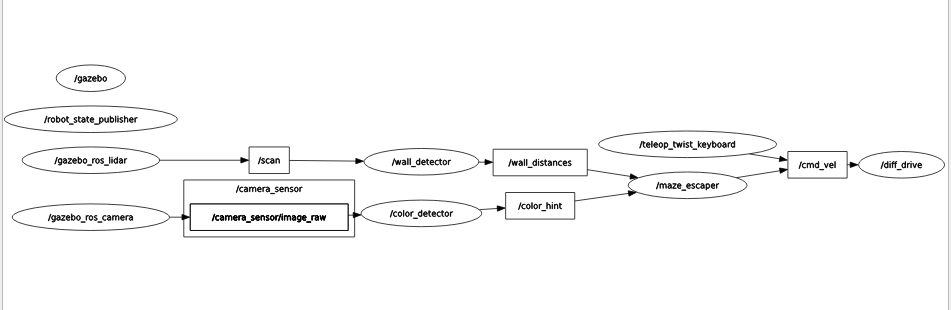

# 미션 3-9: 종합 미션 — Gazebo 미로 탈출

## 목표
라이다 + 카메라를 장착한 로봇이 Gazebo 미로 월드에서 입구부터 출구까지 자율적으로 탈출한다.
3개의 독립 노드가 토픽으로 연결되어 "감지 → 판단 → 구동" 파이프라인을 구성한다.

---

## 디렉토리 구조

```
maze_escaper_3_9/
├── urdf/
│   └── wheeled_robot.urdf       # 라이다(z=0.13) + 카메라 + 앞뒤 캐스터 로봇
├── launch/
│   └── maze_escaper.launch.py   # 전체 시스템 한 번에 실행
├── worlds/
│   └── escape_maze.world        # 분기점, 초록/빨간 색상 표지판 포함 미로
├── maze_escaper_3_9/
│   ├── __init__.py
│   ├── wall_detector.py         # /scan → /wall_distances
│   ├── color_detector.py        # /camera_sensor/image_raw → /color_hint
│   └── maze_escaper.py          # /wall_distances + /color_hint → /cmd_vel
├── resource/
│   └── maze_escaper_3_9
├── setup.py
├── package.xml
└── README.md
```

---

## 명령어 정리

### 빌드
```bash
cd ~/ros2_ws
colcon build --packages-select maze_escaper_3_9
source install/setup.bash
```

### 실행 (전체 시스템)
```bash
ros2 launch maze_escaper_3_9 maze_escaper.launch.py
```

### 수동 모드 전환 (별도 터미널)
```bash
# 수동 모드 전환
ros2 topic pub /mode std_msgs/msg/String "data: 'manual'" --once

# teleop 실행
ros2 run teleop_twist_keyboard teleop_twist_keyboard

# 자율 모드 복귀
ros2 topic pub /mode std_msgs/msg/String "data: 'auto'" --once
```

### rqt_graph 확인
```bash
# 시스템 실행 중에 별도 터미널에서
rqt_graph
```

**모든 노드/토픽 표시 방법**:
rqt_graph 상단 드롭다운을 변경하세요:
```
"Nodes only"  →  "Nodes/Topics (all)"
```
- `Nodes only`: 노드만 표시, 토픽 숨김
- `Nodes/Topics (active)`: 현재 데이터가 흐르는 토픽만 표시
- `Nodes/Topics (all)`: 구독/발행 중인 모든 토픽 표시 (권장)

변경 후 왼쪽 상단 새로고침 버튼(↺)을 눌러야 반영됩니다.

**rqt_graph 시각화 규칙**:
| 표현 | 의미 |
|---|---|
| 타원(원) | 노드 (실행 중인 프로그램) |
| 사각형 | 토픽 (노드 간 데이터 통로) |
| 화살표 방향 | 데이터 흐름 (발행자 → 토픽 → 구독자) |
| 연결 없는 노드 | 실행 중이지만 토픽 연결 없음 (/gazebo, /diff_drive 등) |

**rqt_graph 캡처를 이미지로 저장하는 방법**:
```bash
# docs 폴더 생성
mkdir -p ~/ros2_ws/src/LABA5_Bootcamp/PHASE_3/maze_escaper_3_9/docs

# 스크린샷 저장 후 복사 (파일명은 실제 저장된 이름으로 변경)
cp ~/Pictures/스크린샷.png ~/ros2_ws/src/LABA5_Bootcamp/PHASE_3/maze_escaper_3_9/docs/rqt_graph.png
```

**MD 파일에 이미지 삽입 문법**:
```markdown

```
- 경로는 README.md 파일 기준 상대 경로
- GitHub에 올릴 경우 상대 경로를 사용해야 이미지가 함께 표시됨

**캡쳐 화면**


### Gazebo 종료
```bash
pkill -9 gzserver; pkill -9 gzclient
```

---

## 핵심 파일 설명

### wall_detector.py — /scan → /wall_distances

```python
# angle_min=-π 기준, 스캔 범위를 좁혀서 노이즈 감소
front = ranges[165:196]   # 전방 ±15도 (index 180 기준)
left  = ranges[255:286]   # 좌측 ±15도 (index 270 기준)
right = ranges[75:106]    # 우측 ±15도 (index 90 기준)
```

- `/scan`의 360개 거리값 중 전방/좌/우 구간을 추출해 `/wall_distances`로 발행
- `Float32MultiArray`의 data 순서: `[front, left, right]`
- 초기 범위(±30도)에서 ±15도로 좁혀 노이즈 감소 및 방향 정확도 향상

### color_detector.py — /camera_sensor/image_raw → /color_hint

```python
cv_image = cv_image[:int(h * 0.6), :]   # 하단 40% 제거 (바닥 오탐 방지)

# 임계값 조정 이력
# 초기: green > 500, red > 500
# 1차: green > 4000  (Gazebo 배경 오탐 ~3390픽셀 필터링)
# 최종: green > 30000, red > 30000  (거리 기반 보정 - 약 1m 이내에서만 반응)
if green_pixels > 30000:  hint.data = 'green'
elif red_pixels > 30000:  hint.data = 'red'
```

**임계값 결정 근거**: 빨간 표지판을 2.39m 거리에서 측정했을 때 22,685픽셀 감지.
임계값 30,000은 약 1~1.5m 이내에서만 반응하도록 설계.

### maze_escaper.py — 탈출 알고리즘

```python
self.wall_follow_dist = 0.4   # 왼쪽 벽 목표 유지 거리 (m)
self.front_threshold  = 0.35  # 우회전 시작 거리 (m)
self.back_threshold   = 0.20  # 후진 시작 거리 (m)
self.turn_count = 0           # 회전 지속 카운터
```

**탈출 로직 (우선순위 순서)**:

```
1. front < 0.20m   →  후진 + 회전 (열린 쪽으로, 속도 0.5m/s)
2. color_hint=red  →  좌회전 (1.5 rad/s) + turn_count=8
3. front < 0.35m
   OR turn_count>0 →  우회전 (1.5 rad/s)
                       front > 0.50m이면 turn_count 감소
                       아직 막히면 turn_count=8 리셋
4. color_hint=green→  직진 (0.5m/s, 왼손법칙 override)
5. left > 0.60m    →  좌조향 전진 (왼쪽 벽 쪽으로)
6. left < 0.30m    →  우조향 전진 (왼쪽 벽에서 멀어짐)
7. 그 외            →  직진 (0.5m/s)
```

**색상 힌트 우선순위 결정**:
- 빨간(막다른 길)은 전방 막힘(3번)보다 우선: 벽에 닿기 전에 미리 회피
- 초록(올바른 경로)은 전방 안전한 상태에서만 적용: 안전 > 색상 힌트

**turn_count 히스테리시스**: 전방이 열렸을 때 즉시 회전 종료하지 않고 최소 0.8초(8스텝 × 100ms) 더 유지해 코너를 완전히 돌 수 있게 함.

### URDF 수정 사항: 라이다 높이 조정

camera_3_6에서 복사한 URDF를 그대로 쓰면 라이다가 카메라 링크를 자기 감지하는 문제 발생.

```
카메라 링크: z=0.05 (center), box 0.04 → 상단 z=0.07
라이다 링크: z=0.07 (원래) → 정확히 겹침 → 0.11m 자기 감지
```

```xml
<joint name="lidar_joint" type="fixed">
  <parent link="base_link"/>
  <child link="lidar_link"/>
  <origin xyz="0 0 0.13" rpy="0 0 0"/>   <!-- 0.07 → 0.13 -->
</joint>
```

---

## 노드-토픽 연결 구조

| 발행자 | 토픽 | 메시지 타입 | 구독자 |
|---|---|---|---|
| Gazebo 라이다 플러그인 | `/scan` | LaserScan | `wall_detector` |
| `wall_detector` | `/wall_distances` | Float32MultiArray | `maze_escaper` |
| Gazebo 카메라 플러그인 | `/camera_sensor/image_raw` | Image | `color_detector` |
| `color_detector` | `/color_hint` | String | `maze_escaper` |
| `maze_escaper` | `/cmd_vel` | Twist | Gazebo diff_drive |
| 외부 (ros2 topic pub) | `/mode` | String | `maze_escaper` |
| `robot_state_publisher` | `/robot_description`, `/tf` | - | Gazebo |

---

## 데이터 흐름

```
Gazebo 라이다
    │ /scan (LaserScan, 10Hz)
    ▼
wall_detector
    ranges[165:196] → 전방
    ranges[255:286] → 좌측
    ranges[75:106]  → 우측
    │ /wall_distances (Float32MultiArray: [front, left, right])
    ▼
                        maze_escaper ◄── /color_hint (String)
                             │                    ▲
                             │            color_detector
                             │         /camera_sensor/image_raw
                             │                    ▲
                             │            Gazebo 카메라
                             │
                        ◄── /mode (String: 'auto'/'manual')
                             │
                             ▼ /cmd_vel (Twist)
                        Gazebo diff_drive → 바퀴 구동
```

---

## 트러블슈팅

### front: 0.11m 고정 (self-detection)
- **원인**: 라이다 스캔 평면(z=0.07)이 카메라 링크 상단(z=0.07)과 동일 높이 → 카메라 박스 전면(x=0.11m)이 항상 감지됨
- **해결**: lidar_joint z를 0.07 → 0.13으로 변경

### 제자리에서 빙글빙글 회전
- **원인**: `front_threshold=0.5m`일 때, 0.8m 폭 통로의 수직 방향 벽(~0.4m)도 항상 조건에 걸려 탈출 불가
- **해결**: `front_threshold=0.35m`로 낮춤 + `turn_count` 히스테리시스 도입

### 초록색 오탐 (green_pixels≈3390 고정)
- **원인**: Gazebo 배경/하늘 색이 HSV 초록 범위(H=40~80)에 해당
- **해결**: 이미지 하단 40% 제거 + 임계값 500 → 4000 → 30000 순차 상향

### 빨간 표지판 오작동 (너무 먼 거리에서 반응)
- **원인**: 임계값 500으로 2.39m 거리(22,685픽셀)에서도 반응
- **해결**: 임계값 30,000으로 상향 → 약 1~1.5m 이내에서만 반응

### 색상 힌트 미연결
- **원인**: `/color_hint` 구독은 있었지만 `dist_callback`에서 `self.color_hint`를 사용하지 않음
- **해결**: 우선순위 2번(빨간), 4번(초록)으로 `dist_callback`에 통합

---

## 핵심 배운 점

- **노드 파이프라인 분리**: 감지(wall_detector, color_detector) → 판단(maze_escaper) → 구동으로 역할 분리. 각 노드를 독립적으로 교체·테스트 가능.
- **커스텀 토픽**: `Float32MultiArray`, `String`으로 노드 간 데이터 전달. 메시지 타입만 맞으면 구현 언어에 무관하게 연결 가능.
- **LiDAR 자기 감지**: 라이다 스캔 평면 높이가 로봇 부품 높이와 겹치면 자기 몸체를 장애물로 인식. URDF에서 높이를 다른 부품보다 높게 배치해야 함.
- **히스테리시스(turn_count)**: 0/1 스위칭만으로는 센서 노이즈에 의해 진동 발생. 조건 만족 후 일정 시간 유지하는 카운터 방식으로 안정화.
- **HSV 임계값 캘리브레이션**: 실제 픽셀 수를 로그로 측정 후 거리 기반으로 임계값 결정. 단순히 낮게 설정하면 오탐, 너무 높으면 무반응.
- **`/mode` 토픽**: `ros2 topic pub`으로 실시간 모드 전환. teleop과 자율주행 노드가 동시에 `/cmd_vel`을 발행하면 충돌하므로, `manual` 모드일 때 자율주행 노드가 `return`으로 빠져나오는 구조로 해결.

