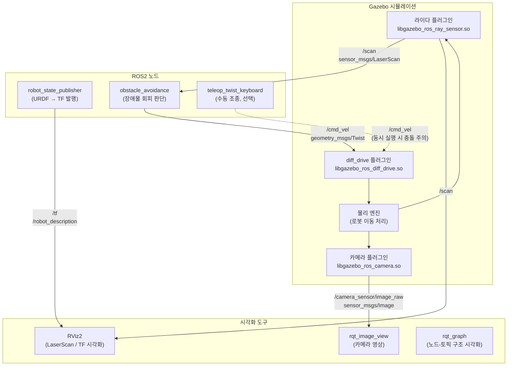

# 미션 3-8: 시스템 구조 시각화 (전체 정리)

## 목표
현재 실행 중인 모든 노드와 토픽의 연결 관계를 시각화하고, Phase 3에서 만든 시스템의 전체 구조를 이해한다.
여러 터미널에서 따로 실행하던 노드들을 하나의 Launch 파일로 묶어서 한 번에 실행한다.

---

## 디렉토리 구조

```
refactoring_3_8/
├── launch/
│   └── full_system.launch.py   # 전체 시스템을 한 번에 실행하는 Launch 파일
├── refactoring_3_8/
│   └── __init__.py
├── resource/
│   └── refactoring_3_8
├── setup.py
├── package.xml
└── README.md
```

3-7과의 차이: 별도 URDF/world 없이 `obstacle_avoidance_3_7` 패키지의 리소스를 참조.
`full_system.launch.py` 하나로 Gazebo + 로봇 소환 + 장애물 회피 노드를 모두 실행.

---

## 명령어 정리

### 패키지 생성 및 구성
```bash
cd ~/ros2_ws/src/LABA5_Bootcamp/PHASE_3
ros2 pkg create refactoring_3_8 --build-type ament_python
mkdir -p refactoring_3_8/launch
```

### 빌드
```bash
cd ~/ros2_ws
colcon build --packages-select refactoring_3_8
source install/setup.bash
```

### 실행 (Launch 파일 하나로 전체 시스템 실행)
```bash
ros2 launch refactoring_3_8 full_system.launch.py
```

### rqt_graph 실행 (다른 터미널)
```bash
rqt_graph
```

### 키보드 조종 (다른 터미널, 선택 사항)
```bash
ros2 run teleop_twist_keyboard teleop_twist_keyboard
```

### Gazebo 종료
```bash
pkill -9 gzserver; pkill -9 gzclient; pkill -9 gazebo
```

---

## 핵심 파일 설명

### launch/full_system.launch.py

```python
import os
from launch import LaunchDescription
from launch.actions import ExecuteProcess
from launch_ros.actions import Node
from launch_ros.parameter_descriptions import ParameterValue
from launch.substitutions import Command
from ament_index_python.packages import get_package_share_directory


def generate_launch_description():

    pkg_path = get_package_share_directory('obstacle_avoidance_3_7')
    urdf_file = os.path.join(pkg_path, 'urdf', 'wheeled_robot.urdf')
    world_file = os.path.join(pkg_path, 'worlds', 'maze.world')

    robot_description = ParameterValue(
        Command(['cat ', urdf_file]),
        value_type=str
    )

    return LaunchDescription([

        # 1. Gazebo + maze.world
        ExecuteProcess(
            cmd=['gazebo', '--verbose', '-s', 'libgazebo_ros_factory.so', world_file],
            output='screen'
        ),

        # 2. robot_state_publisher
        Node(
            package='robot_state_publisher',
            executable='robot_state_publisher',
            parameters=[{'robot_description': robot_description}],
            output='screen'
        ),

        # 3. 로봇 소환
        Node(
            package='gazebo_ros',
            executable='spawn_entity.py',
            arguments=['-topic', 'robot_description', '-entity', 'wheeled_robot',
                       '-x', '-2', '-y', '-2', '-z', '0.1'],
            output='screen'
        ),

        # 4. 장애물 회피 노드
        Node(
            package='obstacle_avoidance_3_7',
            executable='obstacle_avoidance',
            output='screen'
        ),
    ])
```

### Launch 파일의 핵심 요소

| 요소 | 역할 |
|---|---|
| `LaunchDescription` | launch 파일의 루트 컨테이너. 실행할 액션 목록을 담음 |
| `Node(package, executable)` | `ros2 run <package> <executable>`과 동일 |
| `ExecuteProcess(cmd=[...])` | 일반 쉘 명령어 실행 (`gazebo`, `rviz2` 등) |
| `get_package_share_directory` | 설치된 패키지의 share 경로 반환 |

### setup.py — launch 파일 등록

```python
data_files=[
    ...
    ('share/' + package_name + '/launch', ['launch/full_system.launch.py']),
],
```

`ros2 launch`로 실행하려면 `setup.py`의 `data_files`에 launch 파일 경로를 반드시 등록해야 함.
등록하지 않으면 빌드 후에도 launch 파일을 찾지 못함.

---

## rqt_graph 구조 설명

`rqt_graph`는 현재 실행 중인 ROS2 노드와 토픽의 연결 관계를 그래프로 시각화하는 도구.

### 실행 시 표시되는 노드-토픽 연결

| 발행자 (Publisher) | 토픽 | 구독자 (Subscriber) |
|---|---|---|
| `gazebo` (라이다 플러그인) | `/scan` | `obstacle_avoidance` |
| `obstacle_avoidance` | `/cmd_vel` | `gazebo` (diff_drive 플러그인) |
| `robot_state_publisher` | `/robot_description`, `/tf` | `gazebo`, RViz |
| `gazebo` | `/odom` | (없음 or RViz) |

### /cmd_vel 충돌 문제

`teleop_twist_keyboard`와 `obstacle_avoidance` 노드가 동시에 `/cmd_vel`을 발행하면 **두 명령이 번갈아가며 적용**되어 로봇이 예측 불가능하게 움직인다.

ROS2는 동일 토픽에 여러 발행자를 허용하지만, 수신 측(diff_drive 플러그인)은 **마지막으로 받은 메시지를 실행**한다.

→ 해결: 두 노드를 동시에 실행할 때는 한 쪽만 실행하거나, 우선순위 조정 로직(멀티플렉서 노드)을 추가해야 함.

---

## Phase 3 회고

### Phase 2 vs ROS2 구조 비교

| | Phase 2 (카메라 + 라파5 + 아두이노) | Phase 3 (ROS2 + Gazebo) |
|---|---|---|
| 구조 | 단일 파일에 센서·판단·구동 혼재 | 노드별로 역할 분리 |
| 통신 | 시리얼 직접 통신 (커스텀 프로토콜) | 토픽으로 연결 (표준 메시지 타입) |
| 센서 교체 | 코드 대규모 수정 필요 | 토픽 이름만 맞으면 교체 가능 |
| 알고리즘 교체 | 코드 내부 수정 필요 | 해당 노드 파일만 교체 |
| 디버깅 | 전체 코드를 봐야 함 | 각 토픽을 `ros2 topic echo`로 개별 확인 |
| 재사용성 | 낮음 | 높음 (노드 단위로 다른 프로젝트에 사용) |

### Phase 3에서 배운 핵심 개념 총정리

| 미션 | 핵심 개념 |
|---|---|
| 3-3 | URDF 로봇 모델, Gazebo 플러그인, diff_drive |
| 3-4 | SDF 환경 파일, static 물체, 미로 구성 |
| 3-5 | 라이다 센서, sensor_msgs/LaserScan, ranges[] 배열 |
| 3-6 | 카메라 센서, sensor_msgs/Image, cv_bridge, rqt_image_view |
| 3-7 | Subscribe/Publish 패턴으로 자율 주행, angle_min 기반 인덱스 계산 |
| 3-8 | Launch 파일로 시스템 통합, rqt_graph로 구조 시각화 |

---

## 데이터 흐름

```
Gazebo 물리 엔진
    │
    ├── 라이다 센서 → /scan (LaserScan, 10Hz)
    │                      │
    │               obstacle_avoidance 노드
    │                      │ ranges[150:211] → 전방 판단
    │                      │ ranges[240:301] → 좌측 판단
    │                      │ ranges[60:121]  → 우측 판단
    │                      ▼
    │               /cmd_vel (Twist)
    │                      │
    └── diff_drive 플러그인 ← (수신)
            │
            ▼
        바퀴 구동 → 로봇 이동
```

---

## 핵심 배운 점

- **`LaunchDescription`**: Launch 파일의 루트 컨테이너. `Node()`, `ExecuteProcess()` 등 액션을 담아 한 번에 실행.
- **`Node(package, executable)`**: `ros2 run` 명령을 Launch 파일 안에서 실행하는 방법. 노드별 파라미터, 출력 설정 가능.
- **`get_package_share_directory`**: 다른 패키지의 설치 경로를 가져오는 함수. 이 패키지에 URDF/world가 없어도 다른 패키지 것을 참조 가능.
- **`rqt_graph`**: 실행 중인 ROS2 시스템의 노드-토픽 연결 구조를 한눈에 시각화. 아키텍처 이해와 디버깅에 필수.
- **`/cmd_vel` 충돌**: 동일 토픽에 여러 발행자가 있으면 마지막 메시지가 적용됨. 자율 주행과 수동 조종을 동시에 쓰려면 멀티플렉서 노드 필요.
- **ROS2의 모듈화 핵심 장점**: 노드가 토픽으로 느슨하게 연결되어, 각 노드를 독립적으로 교체·개선·재사용할 수 있음. Phase 2의 단일 파일 방식보다 구조적으로 훨씬 유연함.

---

## 시스템 구조 다이어그램 (Mermaid)

> draw.io에서 사용하려면 Extras → Edit Diagram → Mermaid 탭에 붙여넣기


