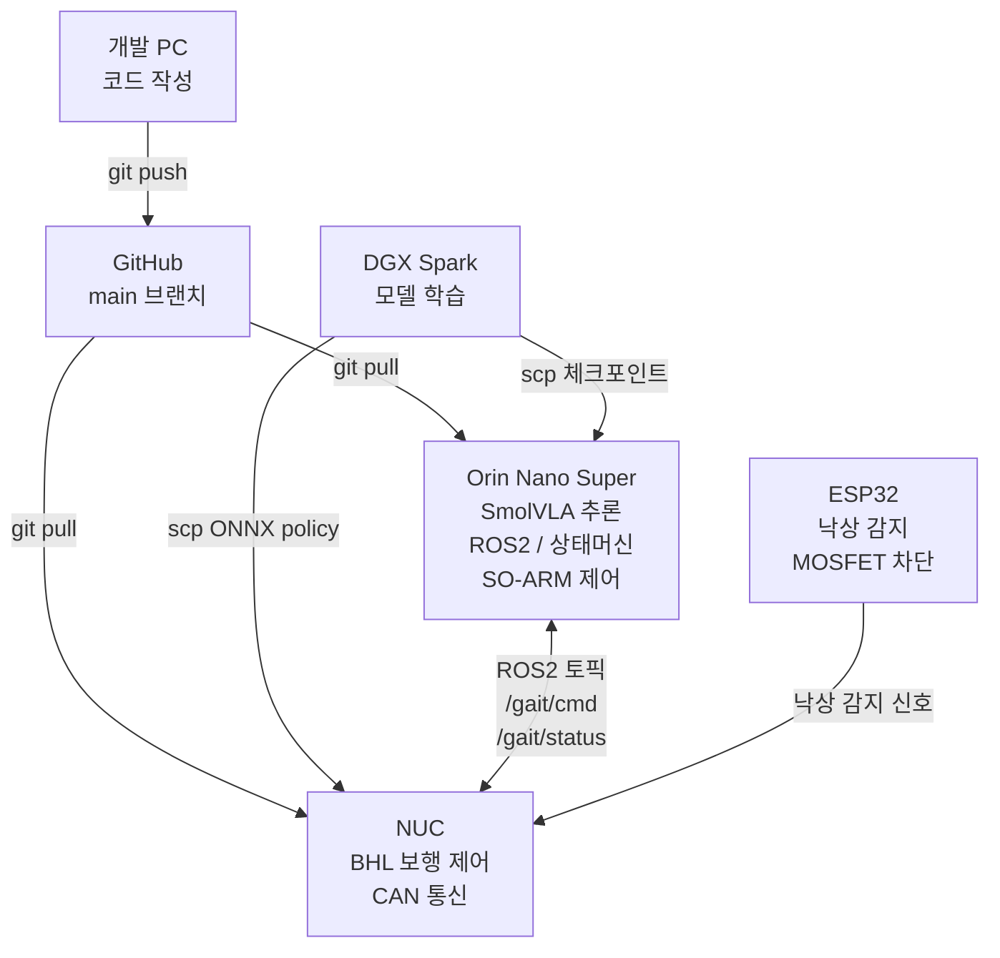
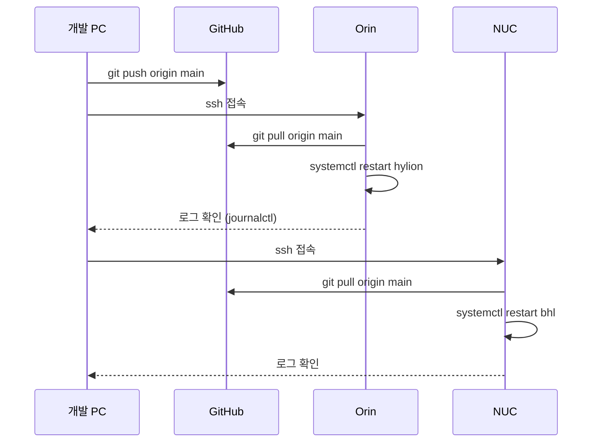
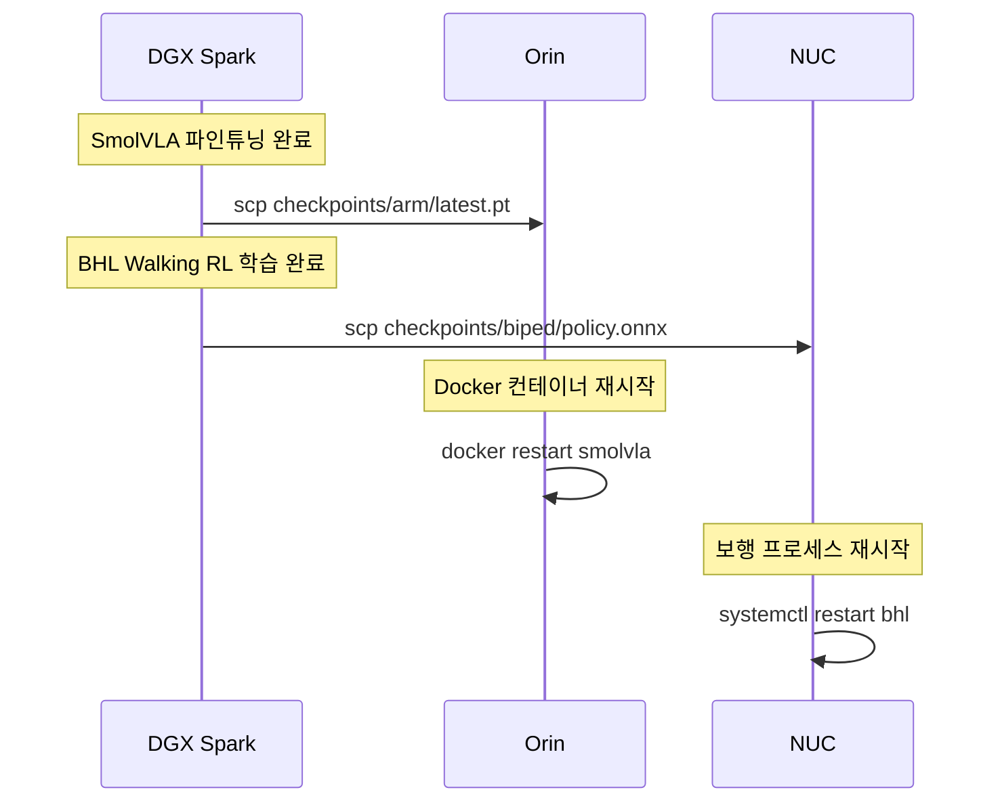
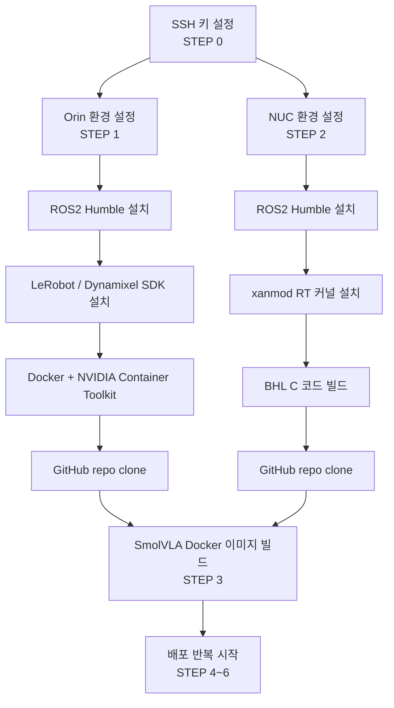
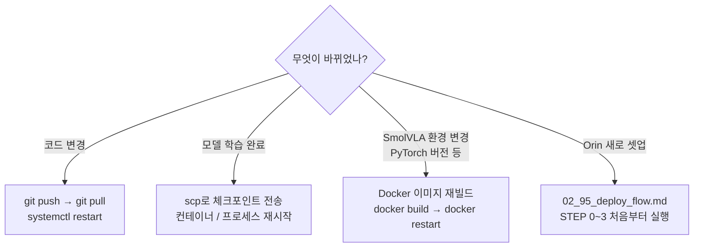

# 하이리온 배포 플로우

> 작성일: 2026.04.16
> 목적: 각 디바이스 환경을 처음 한 번 정확히 세팅해두고, 이후 코드/모델 변경을 반복 배포하는 흐름을 정리한다.

---

## 배포 전략 요약

| 대상 | 배포 방식 | 이유 |
|------|----------|------|
| coordinator.py / fsm.py / ROS2 브릿지 | **git pull** | 코드 변경 빈번 → 빠른 반영 |
| SmolVLA 추론 환경 (Orin) | **Docker** | PyTorch / CUDA 버전 고정 필요 |
| BHL Walking policy (NUC) | **git pull + 직접 빌드** | C 코드베이스, 도커 없이 단순 |
| SmolVLA 체크포인트 (DGX → Orin) | **scp** | 모델 파일은 git에 올리지 않음 |
| BHL ONNX policy (DGX → NUC) | **scp** | 동일 이유 |

---

## STEP 0 — SSH 키 설정 (처음 한 번)

> 비밀번호 없이 Orin / NUC에 접속하기 위한 설정. 한 번만 하면 된다.

- [ ] 개발 PC에서 SSH 키 생성

```bash
ssh-keygen -t ed25519
```

- [ ] Orin에 키 등록

```bash
ssh-copy-id babogaeguri@<ORIN_IP>
```

- [ ] NUC에 키 등록

```bash
ssh-copy-id babogaeguri@<NUC_IP>
```

- [ ] 접속 확인

```bash
ssh babogaeguri@<ORIN_IP>   # 비밀번호 없이 접속되면 OK
ssh babogaeguri@<NUC_IP>
```

---

## STEP 1 — Orin 초기 환경 설정 (처음 한 번)

> JetPack이 설치된 상태에서 시작한다.

### 1-1. 기본 패키지

- [ ] 패키지 업데이트

```bash
sudo apt update && sudo apt upgrade -y
```

- [ ] 필수 도구 설치

```bash
sudo apt install -y git python3-pip python3-venv curl
```

### 1-2. ROS2 Humble 설치

- [ ] ROS2 설치 (공식 문서 기준)

```bash
sudo apt install -y ros-humble-desktop
echo "source /opt/ros/humble/setup.bash" >> ~/.bashrc
source ~/.bashrc
```

- [ ] colcon 설치

```bash
sudo apt install -y python3-colcon-common-extensions
```

- [ ] 확인

```bash
ros2 --version
```

### 1-3. LeRobot / SmolVLA 의존성

- [ ] Python 가상환경 생성 (ROS2와 분리)

```bash
python3 -m venv ~/lerobot_env
source ~/lerobot_env/bin/activate
```

- [ ] LeRobot 설치

```bash
pip install lerobot
```

- [ ] Dynamixel SDK 설치

```bash
pip install dynamixel-sdk
```

### 1-4. Docker 설치 (SmolVLA 추론 환경용)

- [ ] Docker 설치

```bash
sudo apt install -y docker.io docker-compose-v2
sudo usermod -aG docker $USER
newgrp docker
```

- [ ] NVIDIA Container Toolkit 설치 (Orin GPU 접근용)

```bash
sudo apt install -y nvidia-container-toolkit
sudo systemctl restart docker
```

- [ ] 확인

```bash
docker --version
docker run --rm --runtime=nvidia nvidia/cuda:12.0-base-ubuntu22.04 nvidia-smi
```

### 1-5. GitHub repo clone

- [ ] 프로젝트 클론

```bash
cd ~
git clone https://github.com/<팀_계정>/robot_project.git
```

- [ ] 확인

```bash
ls ~/robot_project/jetson/
```

---

## STEP 2 — NUC 초기 환경 설정 (처음 한 번)

### 2-1. 기본 패키지

- [ ] 패키지 업데이트

```bash
sudo apt update && sudo apt upgrade -y
sudo apt install -y git build-essential can-utils
```

### 2-2. ROS2 Humble 설치

- [ ] Orin과 동일한 방법으로 설치 (STEP 1-2 동일)
- [ ] `ROS_DOMAIN_ID` Orin과 동일하게 설정

```bash
echo "export ROS_DOMAIN_ID=0" >> ~/.bashrc
source ~/.bashrc
```

### 2-3. BHL 환경 설정

- [ ] xanmod RT 커널 설치 (BHL 공식 문서 기준)
- [ ] CAN 버스 인터페이스 확인

```bash
ip link show can0
ip link show can1
```

- [ ] GitHub repo clone (Orin과 동일)

```bash
cd ~
git clone https://github.com/<팀_계정>/robot_project.git
```

### 2-4. BHL C 코드 빌드

- [ ] BHL lowlevel 빌드

```bash
cd ~/robot_project/nuc/bhl/csrc
make
```

---

## STEP 3 — SmolVLA Docker 이미지 세팅 (처음 한 번 + 모델 버전 변경 시)

> Orin에서 실행. SmolVLA 추론 환경만 Docker로 관리한다.

- [ ] Dockerfile 확인 (`docker/Dockerfile.smolvla`)
- [ ] 이미지 빌드

```bash
cd ~/robot_project
docker build -f docker/Dockerfile.smolvla -t smolvla:latest .
```

- [ ] 빌드 확인

```bash
docker images | grep smolvla
```

---

## STEP 4 — 모델 파일 배포 (학습 완료 시마다)

> DGX Spark에서 학습 완료 후 Orin / NUC로 전송한다.

### SmolVLA 체크포인트 → Orin

- [ ] DGX에서 Orin으로 전송

```bash
scp checkpoints/arm/latest.pt babogaeguri@<ORIN_IP>:~/robot_project/checkpoints/arm/
```

- [ ] Orin에서 파일 확인

```bash
ssh babogaeguri@<ORIN_IP> "ls ~/robot_project/checkpoints/arm/"
```

### BHL ONNX policy → NUC

- [ ] DGX에서 NUC로 전송

```bash
scp checkpoints/biped/policy.onnx babogaeguri@<NUC_IP>:~/robot_project/checkpoints/biped/
```

---

## STEP 5 — 코드 배포 (수시)

> 코드가 바뀔 때마다 반복한다. SSH로 접속해서 git pull 하면 끝.

### Orin 코드 업데이트

- [ ] Orin SSH 접속

```bash
ssh babogaeguri@<ORIN_IP>
```

- [ ] 최신 코드 받기

```bash
cd ~/robot_project
git pull origin main
```

- [ ] 프로세스 재시작

```bash
sudo systemctl restart hylion
sudo journalctl -u hylion -f   # 로그 확인
```

### NUC 코드 업데이트

- [ ] NUC SSH 접속 후 동일하게 진행

```bash
ssh babogaeguri@<NUC_IP>
cd ~/robot_project
git pull origin main
sudo systemctl restart bhl
```

---

## STEP 6 — 배포 후 동작 확인

- [ ] Orin: IDLE 상태 진입 확인

```bash
sudo journalctl -u hylion -f
# → "IDLE 상태 진입" 로그 확인
```

- [ ] ROS2 토픽 확인 (Orin에서)

```bash
source /opt/ros/humble/setup.bash
ros2 topic list
# /gait/cmd, /gait/status 보이면 OK
```

- [ ] Orin → NUC 통신 확인

```bash
ros2 topic pub /gait/cmd std_msgs/String "data: 'stop'"
# NUC 쪽에서 수신 로그 확인
```

---

## 전체 배포 흐름 요약

```
[개발 PC]
  코드 수정 → git push → main 브랜치

[Orin]
  git pull → systemctl restart hylion

[NUC]
  git pull → systemctl restart bhl

[DGX Spark]
  학습 완료 → scp → Orin checkpoints/arm/
                   → NUC  checkpoints/biped/
```

---

## 브랜치 운용 원칙

| 브랜치 | 용도 |
|--------|------|
| `main` | Orin / NUC에 배포되는 브랜치. 항상 실기기에서 동작하는 상태 유지 |
| `dev` | 팀원 작업 통합 브랜치. 여기서 합친 후 동작 확인 → main merge |
| `feature/xxx` | 개인 작업 브랜치 |

> 발표 전날: `git tag demo-v1` 붙이고 해당 커밋 고정 배포

---

## 참고

- 네트워크 설정: `02_01_network_setting.md`
- 네트워크 연결: `02_02_network_connection.md`
- SSH 접속: `02_98_ssh_connection.md`
- 전체 SW 개발 계획: `99_hylion_sw_dev_plan.md`


## 배포 플로우 시각화

### 전체 장치 구조



---

### 코드 배포 플로우 (수시 반복)



---

### 모델 배포 플로우 (학습 완료 시)



---

### 초기 환경 설정 순서 (처음 한 번)



---

### 배포 판단 기준



